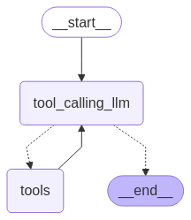

# Agentic AI Chatbot with LangGraph & ReAct


In this project, I designed an agentic AI chatbot using the LangGraph framework and React (Reason and Acting) architecture. This chatbot is designed to understand human messages or queries, figure out the reason for how to respond to them, use search tools to provide relevant information, and then provide a concise answer based on the search results.

# WorkFlow

Chatbot architecture is based on ReAct pattern by langGraph: 



1. **User Input:**  Human message or queris 
2. **LangGarph State:**  Input is added to shared state, which includes the conversation history 
3. **Thought Node (tool_Calling_llm):** LangGraph node which included LLM model. LLM, guided by system prompt based on the ReAct principle generates a "Thought" – its internal reasoning process. It then decides on the next step: either perform an "Action" (use a tool) or provide a final answer(END).
4. **Edge/Conditional Edge:** Connect the nodes
5.  **Action Node (tool):** If the LLM decides to use a tool, this node executes the chosen tool with the arguments provided by the LLM's "Thought."

##### Tools 
In this agentic system, the LLM interacts with the following external tools, enabling it to gather information and perform tasks that result in more informed and relevant outputs.

1. LLM Model - GROQ : 
    - Here I used open source GROQ LLM model "qwen-qwq-32b" to answer the human messgaes
2. Wikipedia
3. Arxiv: Open-access archive for nearly 2.4 million scholarly articles or reserach papers
4. Tavily: Search API to search a latest news or informations

# Setup & Installation:
#### Step 1. Clone the reposioty
git clone "reposioty name"

#### Step 2. Create a venv enviroment & activate it 
```bash
conda create -n agenticAI
```

```bash
conda activate agenticAI
```

#### Step 3 : install the requirements.txt file
pip install -r requirement.txt

#### Step 4 : update the groq and Tavily API Key in .env file
TAVILY_API_KEY="Your Tavily API key"
GROQ_API_KEY="Your Groq API key"

#### Step 5: run the multipleToolsChatbot.ipynb file